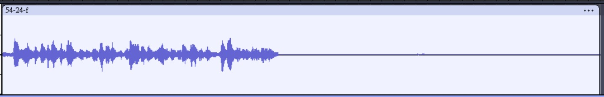
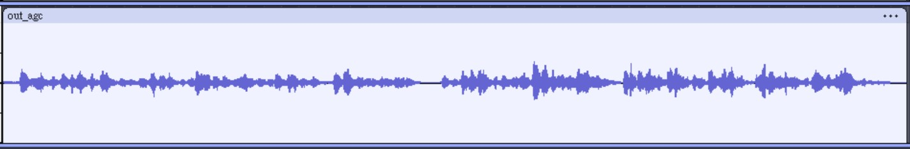

# NN-AGC: Neural Network based Automatic Gain Control

NN-AGC is a neural-network-based Automatic Gain Control (AGC) system for speech audio.
It normalizes volume in real time — even under sudden and drastic gain changes — and
runs as a lightweight C inference engine, making it suitable for real-time / embedded
deployment.

## Quick Start

Try it on a single audio file (**24 kHz sample rate required**):

```bash
cd cpkg
make clean
make
./demo_agc test/54-24-f.wav test/out.wav
```

## Example Result

The example below shows a case where the input level suddenly drops from **-24 dBFS**
to **-54 dBFS**. NN-AGC detects and compensates for the drop in real time, bringing the
output back to a consistent, balanced volume.

| Before | After |
|---|---|
|  |  |

## Overview

The full pipeline goes: **Dataset → Feature extraction → Training → C conversion**.
The steps below walk through the whole process, from preparing training data to
running the final C inference binary.

### Step 1: Prepare the Dataset

Place your speech, noise, and RIR (Room Impulse Response) data into:

```
feature/dataset/speech
feature/dataset/noise
feature/dataset/rir
```

A helper script to generate RIR data is provided at `feature/dataset/gen-rir.py`.

Once the data is ready, build the shared library and generate the training audio:

```bash
# Build and copy libnnagc.so.1 (already included by default)
cd cpkg
make clean
make
cd ../feature
cp ../cpkg/libs/libnnagc.so.1 libs/
python gen_audio.py   # remember to edit the sample count inside the script
```

### Step 2: Train the Model

```bash
python train.py
```

### Step 3: Convert the Python Model to C

```bash
cd dump
python dump_nnagc.py ../ckpts/h40/best.pth.tar ./ckpts/
```

### Step 4: Update the C Source and Rebuild

Copy the newly generated `gru_data.c` into the C project and rebuild:

```bash
cd ../cpkg
cp ../train/dump/ckpts/gru_data_float.c src/gru_data.c
make clean
make
```

### Step 5: Test the Result

```bash
./demo_agc test/54-24-f.wav test/out.wav
```

## Contributions

1. Builds on the AGC framework from
   [CARNIVAL-IITP/Automatic_gain_control](https://github.com/CARNIVAL-IITP/Automatic_gain_control),
   with modified data processing and data augmentation for higher-quality training data.
2. Builds on the C inference framework from
   [xiph/rnnoise](https://github.com/xiph/rnnoise).
3. Converts the original Python inference pipeline into a C inference implementation
   suitable for real-time / embedded use.

## Acknowledgements / References

- [CARNIVAL-IITP/Automatic_gain_control](https://github.com/CARNIVAL-IITP/Automatic_gain_control)
- [xiph/rnnoise](https://github.com/xiph/rnnoise)

## License

This project is licensed under the terms of the [GPL-3.0 License](./LICENSE).
